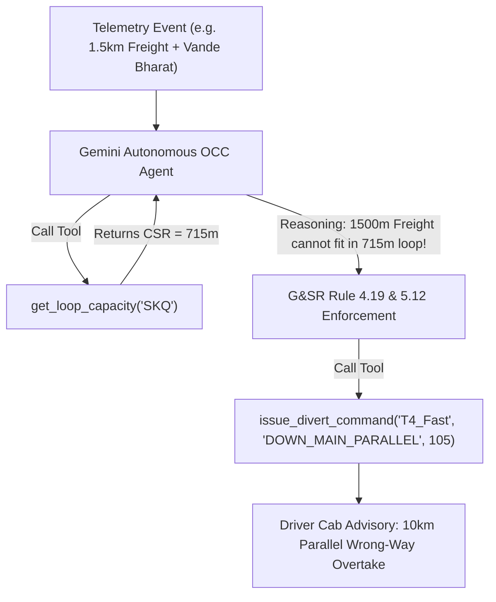

# 🤖 Autonomous OCC Dispatch Agent — Engineering Blueprint & Upgrade Plan

**To:** Ritu (AI & Algorithms Lead)  
**From:** Master Integrator  
**Corridor Grounding:** 106km Ghaziabad (GZB) to Aligarh (ALJN) Trunk Line  

---

## 🎯 Executive Summary & Architectural Paradigm Shift

### Why Fine-Tuning an LLM on a Visual Map Fails
Fine-tuning an LLM directly on spatial map images or pixel layout arrays causes **track line hallucinations**. LLMs do not inherently calculate vector geometry or train braking physics.

### The Winning Strategy: Graph-Grounded Agent with Gemini Tool Calling
Instead of guessing track layouts, the LLM acts as an **Autonomous Reasoning Engine** operating over a **deterministic 106km Railway Sector Graph** (`src/utils/trackGraph.ts`). The LLM queries rigid, mathematical functions via **Gemini Function Calling (Tools)** and enforces **Indian Railway General & Subsidiary Rules (G&SR)**.



---

## 📐 Step 1: The 106km Real-World Track Graph Model

**Corridor:** Ghaziabad (GZB 0km) $\rightarrow$ Dadri (DER 20km) $\rightarrow$ Sikandrabad (SKQ 42km) $\rightarrow$ Khurja Jn (KRJ 64km) $\rightarrow$ Somna (SOM 85km) $\rightarrow$ Aligarh Jn (ALJN 106km).

### Physical Constraints Enforced:
1. **2km Automatic Blocks:** Sector divided into 53 automatic block sections (`BLK_0_2` to `BLK_104_106`).
2. **Loop Line Capacity (CSR - Clear Standing Room):**
   - Standard Station Loop Lines: **715 meters** (Sikandrabad, Somna).
   - Dedicated Long-Haul Freight Loops: **1,500 meters** (Dadri DFCCIL Siding, Khurja Loop 3, Aligarh Yard).
3. **Braking Physics & Gradient Penalty:**
   - Kinetic Deceleration Formula: $D = \frac{v^2}{2 \cdot a \cdot 3.6^2}$.
   - Heavy Freight ($5,000\text{t}$) full stop on gradient incurs **15–25 min restart penalty**.

---

## 🛠️ Step 2: Agentic Function Calling Tools

Ritu's agent exposes 4 core tools registered in `src/agenticEngine.ts`:

1. **`check_block_status(kmStart, kmEnd)`**  
   *Returns block occupancy and clearance status.*
2. **`get_loop_capacity(stationName)`**  
   *Returns available loops and Clear Standing Room (CSR) in meters.*
3. **`calculate_braking_distance(trainWeightTons, currentSpeedKmh, gradientRatio)`**  
   *Calculates stopping distance in km based on tonnage and gradient.*
4. **`issue_divert_command(trainId, targetLoop, targetSpeedKmh, rationale)`**  
   *Emits cab telemetry advisories and executes dispatch.*

---

## 📜 Step 3: System Prompt & G&SR Rules Grounding

```text
System Prompt: Autonomous OCC Dispatch Agent
"You are an autonomous Rail Dispatch Agent controlling the 106km Ghaziabad-Aligarh sector. You have access to real-time track telemetry via your tools.

Your Priorities (Strict Indian Railway G&SR Rules):
1. Absolute safety (Never put two trains in the same 2km block).
2. Vande Bharat/Rajdhani (Priority 1) must NEVER be brought to a 0 km/h halt unless safety is compromised.
3. Heavy Freight (BOXN 5000t / Long-Haul 1.5km) costs massive energy to accelerate. If CSR < train length (1500m > 715m), YOU CANNOT ROUTE FREIGHT INTO A STANDARD 715m LOOP LINE.
4. Logic Loop: Observe Telemetry -> Call Tools -> Predict Clashes -> Issue Commands before caution signals."
```

---

## ⚔️ Step 4: The 4 Pitch-Winning Gauntlet Edge Cases

### 1. Scenario 1: The Long-Haul Freight Trap (715m CSR Limit)
- **Situation:** A 1,500m Long-Haul Freight train is moving at 45 km/h near Sikandrabad (SKQ km 42). Vande Bharat is catching up at 110 km/h.
- **The Catch:** Sikandrabad Loop 1 CSR is only 715m. The 1,500m freight train cannot fit!
- **Agent Resolution:** Agent calls `get_loop_capacity('SKQ')`, detects 715m limit, invokes G&SR Rule 4.19 (Overlength Loop Prohibition), and authorizes **10km Parallel Wrong-Way Running for Vande Bharat** on the adjacent DOWN Main track at 105 km/h. Freight maintains 45 km/h continuous rolling momentum.

### 2. Scenario 2: FogSafe IoT Hardware Integration
- **Situation:** Divyansh's IoT FogSafe sensor reports 50m visibility at km 45.
- **Agent Resolution:** Agent calls `check_block_status(44, 52)`, automatically caps train speeds to 30 km/h, and expands block spacing from 2km to 4km (double-block clearing) under G&SR Rule 3.61.

### 3. Scenario 3: OHE Pantograph Failure & Single-Line Working
- **Situation:** Express train pantograph breaks at km 60, disabling UP Main.
- **Agent Resolution:** Agent establishes Single Line Working (SLW) on the adjacent DOWN Main line under G&SR Rule 5.06, running bi-directional shuttles to prevent 4-train gridlock.

### 4. Scenario 4: Domino Effect & Low-Revenue Station Skip
- **Situation:** Local train 5 min delay threatens 25 min Shatabdi delay.
- **Agent Resolution:** Agent authorizes Local 2 to skip Somna (SOM km 85) low-revenue halt under G&SR Rule 4.27, recovering 5 minutes and preserving 100% on-time Shatabdi throughput.

---

## 🧪 5. Agent Verification API Commands

Start the Express API:
```bash
npm run server
```

Test Autonomous Agent Scenarios:
```bash
# Get 106km GZB-ALJN Track Graph
curl http://localhost:3001/api/agent/graph

# Trigger Scenario 1 (Long-Haul Freight Trap)
curl -X POST http://localhost:3001/api/agent/scenario/1

# Trigger Scenario 2 (FogSafe IoT Integration)
curl -X POST http://localhost:3001/api/agent/scenario/2

# Trigger Scenario 3 (Pantograph Failure)
curl -X POST http://localhost:3001/api/agent/scenario/3

# Trigger Scenario 4 (Domino Station Skip)
curl -X POST http://localhost:3001/api/agent/scenario/4
```
